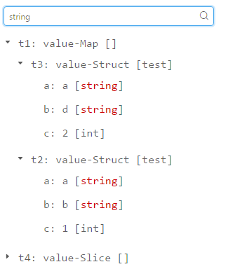

# go-reflect
go-reflect is a universal reflect tool by `golang`, and also has a browser client by [**dvajs**](https://github.com/dvajs/dva) showing reflect result.

dir `server`: reflect tool by golang, it has a `server.go` to provide network service, and `mirror.go` is a core for reflect work.

dir `browser`: browser client for showing reflect result. powered by [**dvajs**](https://github.com/dvajs/dva)

**Features**

* dynamic reflect [reflect on demand]
* reflect EVERYTHING
* visual display result
* search and highlight

**Get Started**

run server:

```
cd go-reflect/server
go test -v
```

run client:

```
cd go-reflect/browser
npm install
npm start
```

then, type `http://127.0.0.1:8000` in browser to see something.

**preview**




